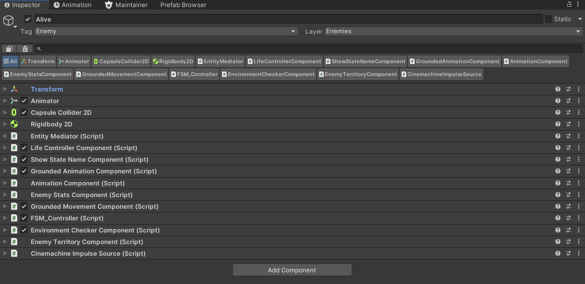
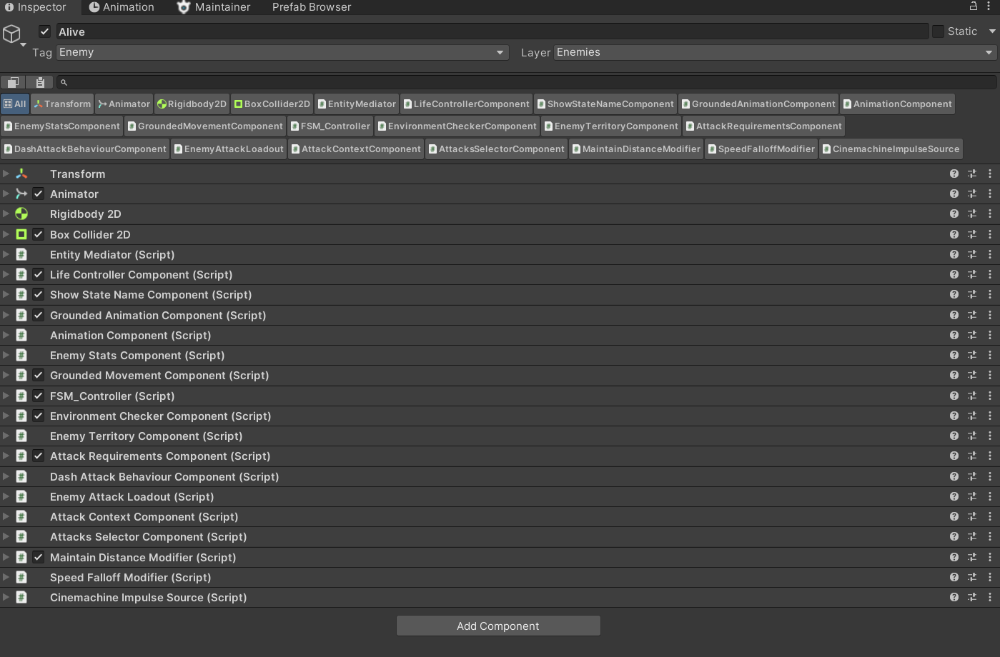

# Unity Modular AI Framework

**Note:** This project is currently a **Work in Progress (WIP)**. While the core architecture is functional, it is undergoing active testing and refinement. Some features may require further stabilization for production environments.

A modular enemy AI system built with ScriptableObject-based states, decoupled behavior components and extensible movement modifiers.

---

## Overview

This framework provides a flexible and scalable architecture for building enemy AI in Unity.

It is designed to allow reusable behaviors, easy configuration and clean separation of responsibilities between systems.

---

## Core Concepts

### State Machine (FSM)

The AI is driven by a finite state machine where each state is implemented as a reusable ScriptableObject.

States contain minimal logic and delegate behavior to specialized components.

---

### ScriptableObject-based IDs

States, animations and movement modifiers are identified using ScriptableObjects instead of strings or enums.

This provides:

* Type safety
* Better scalability
* Easier integration in the editor

---

### Decoupled Components

Enemy behavior is divided into independent components such as:

* Movement
* Vision
* Animation
* Ground detection
* Combat

All communication is handled through a central mediator, avoiding direct dependencies between components.




---

### Movement System

The movement system is built around:

* Base movement types:

  * Grounded
  * Flying
  * (Extendable)

* Extensible Movement Modifiers: 

The system categorizes modifiers into two distinct types:

  * Velocity Modifiers: Influence how the enemy moves (e.g., WaveMotion, SpeedFalloff).
  * Target/Positioning Modifiers: Influence where the enemy moves (e.g., MaintainDistance, OrbitPlayer, ReturnToHome).

Modifiers can be combined to create complex behaviors without modifying the base movement logic.

---

## Architecture Overview

```text
/Assets/AI_Framework/
├── Core (FSM, Mediator, Base Classes)
├── Components
│   ├── Movement (Base + Velocity/Target Modifiers)
│   ├── Combat (AttackSelector, Dash/Explosive attacks)
│   └── Perception (Vision, Territory, GroundDetection)
├── States (Common + Specific Enemy States)
└── Data (ScriptableObjects: IDs, Stats, Maps)
```

---

## Features

* Modular FSM with ScriptableObject states
* Reusable and configurable behaviors
* Decoupled component architecture
* Extensible movement system with modifiers
* Data-driven design using ScriptableObjects
* Clean separation between logic and data

---

## Example Behaviors

Enemies can be composed by combining:

* A specific state setup (Idle, Chase, Attack)
* A movement type (Grounded / Flying)
* A set of movement modifiers

Example:

* Flying enemy with wave movement
* Ranged enemy maintaining distance from player
* Ground enemy with speed falloff when approaching

---

## Data System

### EnemyData

Stores core enemy stats and configuration.

### AttackData

Defines attack-related values and behavior parameters.

---

## Limitations

* Combat Polish: The attack arbitration logic is functional but requires further stress testing with multiple concurrent enemies.
* Edge Case Debugging: Some state transitions may require further refinement under specific physics conditions.
* Visual Tooling: Configuration is currently done via Inspector; a visual Graph Editor is not yet implemented.

---

## Possible Improvements

* Visual state machine editor
* Debug visualization for states and transitions
* Improved attack system modularity
* Better editor integration and tooling

---

## Dependencies

This framework is built to work seamlessly with my **[Advanced Timer System](https://github.com/omAlbert/Unity-advanced-timer-system)**.

## Technologies

* Unity
* C#
* ScriptableObjects
* Custom architecture patterns (FSM, mediator, modular systems)

---
